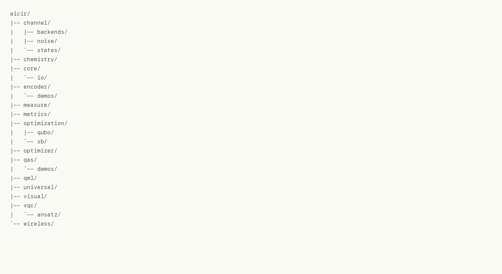

# 项目目录结构

下面是当前仓库的目录结构（目录级）：

~~~text
quantum_frame/
|-- aicir/
|   |-- backends/
|   |-- channel/
|   |   |-- backends/
|   |   `-- noise/
|   |-- chemistry/
|   |-- core/
|   |   `-- io/
|   |-- devices/
|   |-- encoder/
|   |   `-- demos/
|   |-- gates/
|   |-- ir/
|   |-- measure/
|   |-- metrics/
|   |-- noise/
|   |-- optimization/
|   |   |-- qubo/
|   |   `-- sb/
|   |-- optimizer/
|   |-- primitives/
|   |-- qas/
|   |   `-- demos/
|   |-- qml/
|   |-- transpile/
|   |   `-- passes/
|   |-- universal/
|   |-- visual/
|   |-- vqc/
|   |   `-- ansatz/
|   `-- wireless/
|-- demos/
|   |-- BeH2/
|   |-- H2O/
|   |   |-- result_cpu/
|   |   |-- result_npu_1/
|   |   |-- result_npu_2/
|   |   `-- result_npu_3/
|   |-- LiH/
|   |-- MaxCut/
|   |-- mnist/
|   `-- visual_outputs/
|-- docs/
|   `-- superpowers/
`-- tests/
    |-- algorithms/
    |-- backends/
    |-- chemistry/
    |-- circuit/
    |   `-- io/
    |-- execution/
    |-- measure/
    |-- metrics/
    |-- noise/
    |-- optimizer/
    |-- qml/
    |-- transpile/
    |-- universal/
    |-- visual/
    `-- vqc/
~~~

目录结构图片（横版）：

